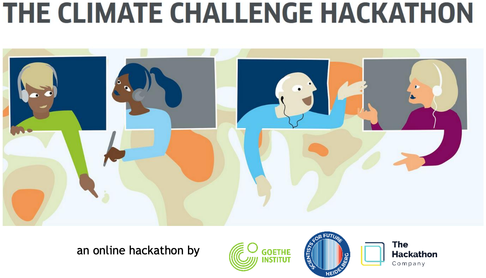
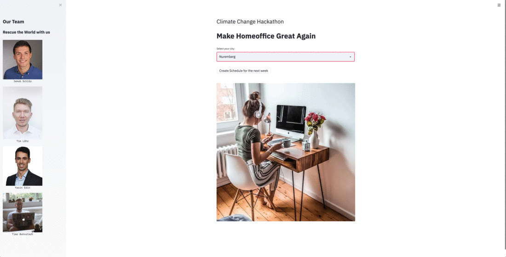

<div align="center"> 

<h1>Climate Challenge Hackathon<h1>
<h2>Make Homeoffice Great Again<h2>
</div>

## Abstract


The problem your project solves
Due to the various CoVid-19 measures implemented worldwide, global emissions from surface transport fell by –36% or –7.5 (–5.9 to –9.6) MtCO​ d​by 7 April 2020 in comparison to the
2​
previous year (1). CoVid-19 has thus been named as the digitization driver for home office,
which is a significant part of surface transport (ca. 20%). We want to make sure that companies will not return to business as usual and continue to enable their employees to work remotely.
The reduction of personal CO2 emissions alone has shown to be not sufficient for the general public to adopt measures. Thus, we are convinced that solely personal benefits, in our case saving money and time by staying at home, would have the potential to be used by a wider audience. Based on a survey by ​Greenpeace (2020)​we estimate the potential of home office in Germany to 4.8 mil tonnes per year which is around 3% of Germany's surface transport emissions.

## Content

- Python Notebook as [iPython](https://github.com/Mavengence/Climate_Challenge_Hackathon/Notebooks/get_data_eval_days.ipynb)
- Report/Paper as [PDF](https://github.com/Mavengence/Climate_Challenge_Hackathon/blob/master/Final_Report.pdf)
- Presentation as [PDF](https://github.com/Mavengence/Climate_Challenge_Hackathon/blob/master/Final_Presentation.pdf)


## Structure

```

+-- Code
|   +-- Notebooks                        
|   |    +-- get_data_eval_days.ipynb
|   +-- Scripts                        
|   |    +-- calendar_api.py
|   |    +-- main.py
|   |    +-- utils.py
|   +-- Data                      
|   |    +-- apple_map.csv     # big data - apple traffic data
|   |    +-- forecast.csv      # weather forecast data
|   |    +-- schedule_df.csv   # have we already scheduled for this week
|   |    +-- worldcities.csv   # select your city
|   +-- Auth             
|        +-- credentials.json  # to be downloaded from you    
|        +-- secrets.txt       # type in the three auth variables  
|
+-- Images
+-- Final_Report.pdf   
+-- Final_Presentation.pdf                    
+-- environment.yml                    
+-- readme.md
+-- .gitignore    

```

## Prerequisites

Create the conda environment:

``` 
    conda env create -f environment.yml
```

if you dont create and environment, install this:

```
    pip install --upgrade google-api-python-client google-auth-httplib2 google-auth-oauthlib
    pip install streamlit
```

### Follow these steps:

##### Credentials.json

1) Go to https://developers.google.com/calendar/quickstart/python

2) Then click the button at Step 1: "Enable the Google Calendar API"

3) Download *only* the "credentials.json" and put it into the *Auth* folder.

##### Calendar ID

4) Go to your Google Calendar, click on the settings for your preferred calendar and scroll down until you see *Calendar-ID*

5) Take this *Calendar-ID* and paste into the *CALENDAR_ID* variable of the *secrets.txt*.

##### Embedd Google Calendar

5) In the same Google Calendar settings page copy the *iframe src*. But only the string after *src=*

7) Copy this *src* string into *IFRAME* variable of the *secrets.txt*.

##### Weather feature API

8) Go to https://openweathermap.org/api/one-call-api sign up and free account and copy paste the API token into the *WEATHER_API* variable of the *secrets.txt*.

``` 
 CALENDAR_ID example = 5te5rblablablablaj7ddgj08@group.calendar.google.com

 IFRAME src example = https://calendar.google.com/calendar/embed?src=blablablablabla08%40group.calendar.google.com&ctz=Europe%2FBerlin

 API_KEY example = "30d90blablablabla78d09e6d00"

```

## Getting Started

1) Clone the repository, to get our Notebooks, Presentation and Project Report.

```
git clone https://github.com/Mavengence/Climate_Challenge_Hackathon
```

2) After you pasted into the *secrets.txt* the three necessary authentication strings you are ready to go.

3) Go into the project folder and then into Scripts, so that you see the main.py and run this:

```
    streamlit run main.py
```

4) You will be asked to log in with your Google Account. This is good. Log in, the *token* will be created in the *Auth* folder and the WebApp is running.

5) Enjoy and save the world!

## See it working

<center>

</center>


## Workflow

When you click the button *Create Scheduler for next week*, an entry in the *Data/scheduler_df.csv* will be created for the upcoming week.
For that reason you cannot create multiple events for the upcoming week. If you wanna re-do the event adding, just go into the *scheduler_df.csv* 
and set the True to False.


## Run the Notebook

```
    cd/you_cloned_repo_location/Notebooks jupyter notebook
```

## Deployment

Just pull the repo, if you wanna change sth you can ask :)

## Authors

* **Tim Löhr** - [GitHub Mavengence](https://github.com/Mavengence)
* **Jakob Schlör** - [GitHub Jakob](https://github.com/jakob-schloer)
* **Timo Bohnstedt** - [GitHub Bohniti](https://github.com/bohniti)
* **Yasin Edin** 


## Ressources

- Nature Article: https://www.nature.com/articles/s41558-020-0797-x
- BBC Article: https://www.bbc.com/worklife/article/20201023-coronavirus-how-will-the-pandemic-change-the-way-we-work
- BBC Article: https://www.bbc.com/news/science-environment-49349566
- Apple Mobility: https://covid19.apple.com/mobility


## License

MIT license, just don't repackage it and call it your own please!
Also if you do make some changes, feel free to make a pull request and help make things more awesome!

